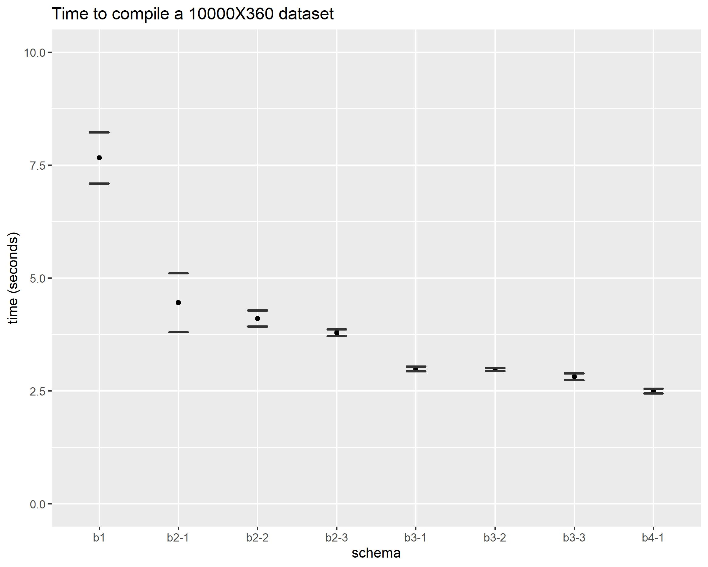

# reamparser.js

[reamparser.js](https://github.com/chmlee/reamparser.js) is a parser and emitter for REAM written in JavaScript.

NOTE: [REAM-editor](https://github.com/chmlee/ream-editor) ships with reamparser.js and does not required a local copy of the parser.

## Reqruiements

- node.js
- commander.js if using the CLI tool `parsemd`

## Installation

```shell
$ git clone https://github.com/chmlee/reamparser.js
```

## Usage

### Import as module

```javascript
// const fs = require('fs');
// fileText = fs.readFileSync('path/to/REAM/file', 'utf8')

const { MdFile } = require('path/to/ream.min.js');

const mdFile = new MdFile(fileText);
const mdCSV = mdFile.toCSV();
```

### CLI

The CLI tool `parsemd` requires `commander`.
Install `commander` with npm:

```shell
$ npm install commander
```

`parsemd` take a path as an argument, and output the compiled CSV as stdout.

```shell
$ path/to/parsemd path/to/input.md
```

To save the output, pipe the stdout to a file:

```shell
$ path/to/parsemd path/to/input.md > path/to/output.csv
```

## Benchmark

The parser is fairly fast.
It compiles a 10000 rows * 360 columns dataset in about 7 seconds, and can be as fast as 3 seconds if utilizes REAM's inheritance feature.

To test it, first generate the eight benchmark REAM files with [`generator.py`](https://github.com/chmlee/reamparser.js/blob/master/benchmark/generator.py).
They are identical in content, but with different schemas.
You can use any benchmark tools you desire, but if you are using [hyperfine](https://github.com/sharkdp/hyperfine), you can run the script [`benchmark.sh`](https://github.com/chmlee/reamparser.js/blob/master/benchmark/benchmark.sh) I used.

The results are as follow:


